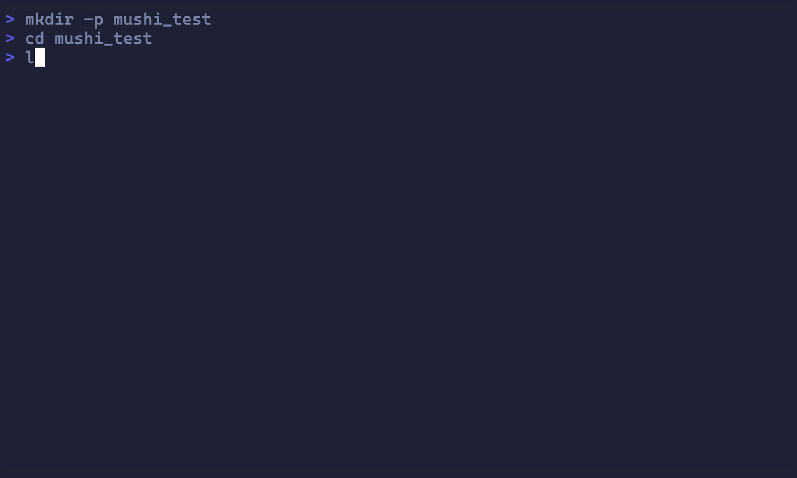

# mushi - gitignore Template Generator

`mushi` is a command-line tool for generating `.gitignore` files from templates, inspired by the [github/gitignore](https://github.com/github/gitignore) repository. It provides both interactive and non-interactive modes to quickly create comprehensive ignore files for your projects.



## Features

- **Template-based generation**: Use templates from the official github/gitignore repository
- **Interactive mode**: Fuzzy-search and select templates with a TUI interface
- **Customizable common.gitignores**: Define your own default ignore patterns
- **Local caching**: Templates are cached locally for fast access
- **Force overwrite**: Option to overwrite existing `.gitignore` files
- **Template listing**: List all available templates with `mushi list`
- **Print to stdout**: Preview output without writing to file using `--print`

## Installation

```bash
go install github.com/sirasagi62/mushi@latest
```

## Usage

### Basic Usage

Generate a `.gitignore` file using a specific template:

```bash
mushi create Go
```

### Interactive Mode

Select a template interactively with fuzzy search:

```bash
mushi create -i
```

### Force Overwrite

Overwrite an existing `.gitignore` file:

```bash
mushi create Go -f
# or
mushi create Go --force
```

### Append to Existing .gitignore

Append a template to an existing `.gitignore` file:

```bash
mushi append Go
```

With interactive selection:

```bash
mushi append -i
```

By default, `append` does not include patterns from `common.gitignore`. To include them:

```bash
mushi append Go --no-common=false
```

Or disable common patterns explicitly:

```bash
mushi append Go --no-common
```

### List Available Templates

List all available gitignore templates:

```bash
mushi list
```

This command shows all templates available in the local cache, including those in subdirectories.

### Print to Standard Output

Preview the generated content without writing to a file:

```bash
mushi create Go --print
mushi append Python --print
```

This is useful for inspecting the output before writing it to a file.

### Cache Management

Update the local template cache:

```bash
mushi cache update
```

Clean the local cache:

```bash
mushi cache clean
```

### Cache Update Control

You can control whether the local cache is automatically updated when creating a `.gitignore` file:

- **Command-line flag**: Use `--no-update` to skip cache updates for a single command
  ```bash
  mushi create Go --no-update
  ```

- **Configuration file**: Set `no_update = true` in `~/.config/mushi/config.toml` to disable automatic updates globally

The command-line flag takes precedence over the configuration file setting.

## Configuration

`mushi` uses the following directories and files:

- **Configuration directory**: `~/.config/mushi/`
- **Common ignore file**: `~/.config/mushi/common.gitignore` (automatically created with default patterns)
- **Configuration file**: `~/.config/mushi/config.toml` (automatically created with default settings)
- **Cache directory**: `~/.cache/mushi/github-gitignore/` (local clone of github/gitignore)

The `common.gitignore` file contains default ignore patterns that are prepended to every generated `.gitignore` file. You can edit this file to customize your default ignores.

The `config.toml` file allows you to customize mushi's behavior. On first run, it will be created with the following default content:

```toml
# mushi configuration file

# Whether to skip updating the local cache
# no_update = false
```

Uncomment and modify the `no_update` line to change the default behavior.

### Common.gitignore Imports

The `common.gitignore` file supports importing other templates using the `#Import:` directive:

```gitignore
#Import:Global/macOS
#Import:Global/Windows
#Import:Global/Linux
#Import:community/OpenSSL
```

This allows you to include patterns from the github/gitignore repository in your common ignore file. On first run, `common.gitignore` is created with these default imports.

## How It Works

1. On first run, `mushi` clones the [github/gitignore](https://github.com/github/gitignore) repository to your local cache and creates default configuration files
2. When you create a `.gitignore`, it:
   - Checks if the cache should be updated (based on command-line flag and config file)
   - Updates the local cache if needed
   - Reads your custom `common.gitignore` file (resolving any imports)
   - Combines it with the selected template
   - Writes the result to `./.gitignore`

## License

The program itself, written in Golang, is distributed under the MIT License. See the [LICENSE](LICENSE) file for details.
However, `cmd/default.txt` and the default `~/.config/mushi/common.gitignore` generated from it are distributed under CC0.
See [./third_party_licenses](/third_party_licenses) for licenses of dependent third-party libraries.
